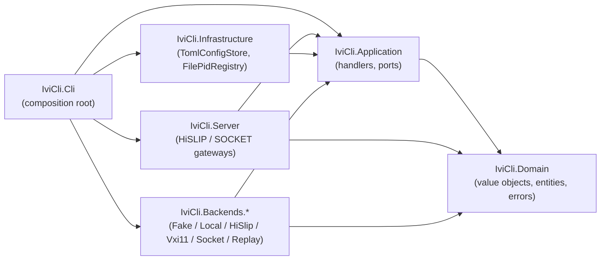

[English](README.md) | **日本語**

# ivi-cli

`ivi-cli` は、VISA/IVI 経由で計測器を管理・診断・操作する統合 CLI です。

> ステータス: **alpha** — Phase 1–3 まで landed、現在 batch C 進行中。サブコマンド木 (HiSLIP / SOCKET gateway 含む) はビルド・配備可能。v0.1.0 までは破壊的変更が発生する可能性があります。

## ハイライト

- **状態保持型 UX.** `ivicli visa add psu1 ...` で alias を一度登録すれば、以降は `psu1` だけで操作できます。
- **VISA 互換.** 標準的な `TCPIP::` / `USB::` / `GPIB::` のリソース文字列を独自構文なしで扱います。
- **複数バックエンド.** Local NI-VISA / HiSLIP / VXI-11 / raw TCP SOCKET / Fake (プログラム可能 + scenario 再生) / Replay (厳密な決定論的再生) を単一の `IIviBackend` port 越しに提供します。
- **ゲートウェイサーバ.** ローカル計測器を HiSLIP (`TCPIP::host::hislip0::INSTR`) または raw socket で公開し、リモートの PyVISA / NI-VISA クライアントから駆動できます。
- **シナリオ録画.** `mock scenario record --from-script` でスクリプト実行中の SCPI トラフィックを取得、`IVICLI_REPLAY=<scenario>` で同じスクリプトをハードウェアなしに決定論的に再実行できます。
- **監査向け.** `IVICLI_CAPTURE=<path>` を設定するとすべての backend 操作が NDJSON ログにストリームされ、`tail -f path | jq` で後追い確認やサポート提出に利用できます。
- **スクリプト Lint.** `visa lint foo.scpi` で IEEE 488.2 / SCPI core の語彙に対する未知のルートを計測器に触らずに検出します。
- **一度録って何度でも再生.** `IVICLI_CAPTURE` で実機セッションを取り、`mock scenario import` で scenario に変換、以後 `IVICLI_REPLAY=<name>` で同じ動作をハードウェア占有なしに再現できます。
- **コントロールプレーン.** `ivicli api start` で HTTP JSON API を `http://127.0.0.1:8080/v1` に公開（`/openapi/v1.json` 付き）。AI agent / ダッシュボード / CI スクリプトが VISA を喋らずに device 列挙・SCPI クエリ・status 取得できます。
- **ブラウザ向けストリーミング.** WebSocket を `ws://127.0.0.1:8080/v1/devices/{name}/visa` に開けば `{op:'query',scpi:'…'}` フレームを送って `{event:'response',…}` で受け取れます。ダッシュボードや AI agent ランタイム向け (ADR 0035)。
- **API の鍵掛け.** `ivicli api token create` で PAT を生成（表示は 1 回限り、保存されるのはハッシュのみ）。HTTP は `Authorization: Bearer …`、WebSocket は `ivi-cli-pat.<token>` サブプロトコルで検証され、loopback の外にもバインドできます (ADR 0036)。
- **自動化指向.** stdout はデータ (`--json` 含む)、stderr はログ専用。終了コードは POSIX 慣習に従い、bash / zsh / PowerShell の補完をサポートします。

## インストール

```sh
# .NET tool（.NET 10 SDK / runtime 必須）
dotnet tool install -g ivi-cli

# self-contained single-file バイナリ（.NET インストール不要）
# GitHub Releases から各 OS / arch のアーティファクトを取得してください。
```

リリースは `win-x64` / `win-arm64` / `linux-x64` / `linux-arm64` / `osx-x64` / `osx-arm64` を提供します。

## Docker でクイックスタート (mock-VISA e2e)

開発中の VISA アプリの e2e テスト用に「スクリプト可能な VISA 計測器」を立てたい開発者向け — ハードウェア不要、.NET インストール不要、設定不要:

```sh
docker run --rm -p 4880:4880 -p 5025:5025 \
    ghcr.io/shortarrow/ivi-cli-mock:latest

# 別ターミナルから ivicli 自身 (or 任意の SCPI クライアント) で:
ivicli visa add mock TCPIP::localhost::hislip0::INSTR
ivicli visa query mock "*IDN?"
# → IVICLI-MOCK,gateway,1,0.1.0
```

コンテナは HiSlip gateway を `4880`、raw SOCKET gateway を `5025` で公開します。両方とも scenario 駆動の mock backend (`*IDN?` / `*RST` / `*OPC?` / `SYST:ERR?` が初期対応済) でバックエンドされます。独自シナリオは `-v ./scenarios:/etc/ivi-cli/scenarios` でマウント、テスト中に動的に状態を arm するには `docker exec mock ivicli mock scene add …` を使います。詳細は [ADR 0018](docs/adr/0018-deployment-strategy.md) を参照してください。

## クイックスタート

```sh
# 1. 計測器を登録
ivicli visa add psu1 TCPIP0::192.168.0.10::inst0::INSTR
ivicli visa use psu1

# 2. 通信
ivicli visa query "*IDN?"
ivicli visa write "OUTP ON"

# 3. ハードウェアの代わりに録画済みシナリオを再生
IVICLI_REPLAY=psu1-smoke ivicli visa query "*IDN?"

# 4. 登録した計測器をライブ表示で監視 (Ctrl+C で終了)
ivicli visa watch --interval 500

# 5. リモートクライアント用に HiSLIP で公開
ivicli server add hislip-srv --type hislip --port 4880
ivicli server route add hislip-srv hislip0 psu1
ivicli server start hislip-srv
```

設定ファイルは OS ごとに XDG 風のパスに置かれます:

| OS | 既定パス |
| --- | --- |
| Linux | `$XDG_CONFIG_HOME/ivi-cli/config.toml`（既定で `~/.config/ivi-cli/config.toml`） |
| macOS | `~/.config/ivi-cli/config.toml` |
| Windows | `%LOCALAPPDATA%\ivi-cli\config.toml` |

環境変数 `IVICLI_CONFIG` で上書き可能です。

## サブコマンドマップ

| グループ | 動詞 | 用途 |
| --- | --- | --- |
| `visa` | `add` `remove` `list` `use` `current` `scan` `query` `write` `read` `status` `script` `monitor` `watch` `lint` | 計測器の管理と通信 |
| `mock scenario` | `list` `create` `remove` `show` `activate` `deactivate` `record` `import` + `scene add` / `scene remove` | モックデバイス用シナリオの編集と記録 |
| `server` | `add` `remove` `list` `route add` / `route remove` / `route list` `start` `stop` `status` `log` | ゲートウェイサーバのライフサイクル |
| `api` | `start` `stop` `token create` `token list` `token revoke` | Management HTTP JSON API (ADR 0034) + WebSocket サブプロトコル (ADR 0035) + PAT 認証 (ADR 0036) |
| top-level | `diagnose` `completion <shell>` | 環境ヘルスチェック + シェル補完 |

## 詳細度 / フォーマットのフラグ

| フラグ | 効果 |
| --- | --- |
| （なし） | Information 以上 |
| `-v`, `--verbose` | Debug 以上 |
| `-vv` | Trace 以上 |
| `-q`, `--quiet` | Warning 未満を console から抑制（file sink には影響なし） |
| `--log-file <path>` | rolling log file の出力先を上書き |
| `--log-format human\|json` | console の format（既定 `human`） |

## シェル補完

```sh
# bash: .bashrc から source
eval "$(ivicli completion bash)"

# zsh: .zshrc から source
eval "$(ivicli completion zsh)"

# PowerShell: $PROFILE から source
ivicli completion powershell | Out-String | Invoke-Expression
```

導入後、`<Tab>` でサブコマンド・オプション・実行時識別子（device alias、server 名、scenario 名）が展開されます。

## アーキテクチャ



依存方向は一方向 (Domain ← Application ← {Infrastructure, Backends, Server} ← Cli)。アーキテクチャテスト (`tests/IviCli.Cli.Tests/Architecture/`) が PR ごとに違反を検知します。

## ドキュメント

- [PRD](docs/PRD.jp.md) — プロダクト要件 ([English](docs/PRD.md))
- [Architecture Decision Records](docs/adr/) — Accepted な意思決定。読み始めの推奨: [ADR 0003](docs/adr/0003-architecture-style.md) (アーキテクチャスタイル)、[ADR 0021](docs/adr/0021-repository-layout.md) (層アセンブリ)、[ADR 0007](docs/adr/0007-network-transport.md) (HiSLIP / SOCKET)
- [Domain glossary](docs/domain-glossary.md) — ユビキタス言語カタログ
- [Contributing](CONTRIBUTING.jp.md) — ローカル開発・ブランチ運用・hooks ([English](CONTRIBUTING.md))

## ソースからビルド

```sh
dotnet tool restore
dotnet restore --locked-mode
dotnet build
dotnet test --filter "Category!=Integration"
```

ローカル hooks (commit 時 CSharpier formatter チェック、push 時 build + tests) は初回 `dotnet husky install` で導入されます。

## ライセンス

ライセンス未定。`LICENSE` ファイルがコミットされるまでは "all rights reserved" として扱ってください。再利用前に明確化が必要な場合は issue を開いてください。
