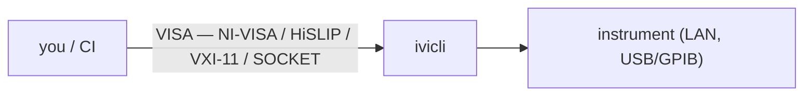
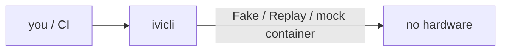
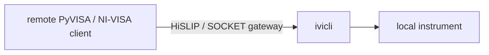
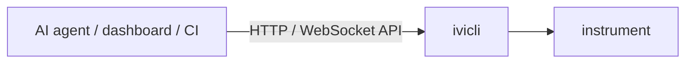

**English** | [日本語](docs/README.jp.md)

# ivi-cli

`ivi-cli` is an integrated CLI for managing, diagnosing, and operating instruments addressed via VISA/IVI.

> Status: **v0.2.7 (pre-1.0.0).** Phase 1–3 are landed: CLI core, HiSLIP / VXI-11 / SOCKET gateways, scenario-driven mock-VISA container (ghcr.io/shortarrow/ivi-cli-mock), Management HTTP / WebSocket API with PAT + TLS + audit, OpenTelemetry, and LAN discovery (LXI mDNS + VXI-11 broadcast, plus opt-in `--port` socket sweep). Breaking changes are still possible per [ADR 0022](docs/adr/0022-branching-strategy.md). See [CHANGELOG.md](docs/CHANGELOG.md).

## Highlights

- **Stateful, VISA-native CLI**
  - **A current device, like a shell's working directory.** `ivicli visa add psu1 <resource>` registers an alias once; `ivicli visa use psu1` makes it *the current device*, so every later `visa query` / `write` / `script` needs no target at all — no VISA resource, not even the alias.
  - **VISA-compatible.** Parses standard `TCPIP::`, `USB::`, `GPIB::` resource strings without proprietary syntax.
  - **Automation-friendly.** Stdout carries data (including `--json`); stderr carries logs. Exit codes are POSIX-conventional. Shell completion ships for bash / zsh / PowerShell.
- **Discover & inspect**
  - **Auto-discovery.** `ivicli visa scan` walks the LAN via LXI mDNS / DNS-SD + VXI-11 portmapper broadcast and lists every responder; `--add` registers them all in one shot.
  - **IVI Configuration Store introspection.** `ivicli driver list` / `ivicli logical list` parse `IviConfigurationStore.xml` to enumerate installed IVI drivers and logical names — debugging "instrument talks but driver mismatched" without opening the Configuration Server GUI ([ADR 0045](docs/adr/0045-ivi-configuration-store.md)).
- **Backends & gateways**
  - **Multiple backends.** Local NI-VISA, HiSLIP, VXI-11, raw TCP SOCKET, Fake (programmable + scenario playback), Replay (strict deterministic playback) — all behind a single `IIviBackend` port.
  - **Gateway servers.** Expose a local instrument over HiSLIP (`TCPIP::host::hislip0::INSTR`) or raw socket so remote PyVISA / NI-VISA clients can drive it without redeploying the test.
- **Test without hardware**
  - **Run a mock instrument.** The `Fake` backend answers SCPI from a *scenario* — a scripted set of `query → response` rules — so `ivicli` (or your own VISA app) can talk to a stand-in with zero bench time.
  - **Capture, then replay.** Record a live session (`IVICLI_CAPTURE=<path>`) or a SCPI script run (`mock scenario record --from-script foo.scpi`) into a scenario, then re-run it deterministically with `IVICLI_REPLAY=<scenario>` — no hardware burned on regression checks.
  - **Run & lint SCPI scripts.** `visa script foo.scpi` runs a `.scpi` file — [SCPI](https://www.ivifoundation.org/downloads/SCPI/scpi-99.pdf) commands plus ivi-cli's inline assertions ([ADR 0027](docs/adr/0027-phase3-operator-automation.md)) — against the current device; `visa lint foo.scpi` flags unknown SCPI roots (IEEE 488.2 + SCPI core) before you run it.
  - **Audit-friendly.** Set `IVICLI_CAPTURE=<path>` and every backend operation streams to an NDJSON log for post-hoc inspection — `tail -f path | jq` or hand it to support.
- **Control plane (HTTP / WebSocket API)**
  - **JSON HTTP API.** `ivicli api start` exposes a JSON HTTP API at `http://127.0.0.1:8080/v1` (with `/openapi/v1.json`) so AI agents, dashboards, and CI scripts can list devices / fire SCPI queries / read status without speaking VISA.
  - **Browser-friendly streaming.** A WebSocket at `ws://127.0.0.1:8080/v1/devices/{name}/visa` carries `{op:'query',scpi:'…'}` frames and replies with `{event:'response',…}` — drop-in for any dashboard or AI agent runtime (ADR 0035).
  - **Lock down the API.** `ivicli api token create` mints a PAT (shown once, only the hash is stored); the listener validates `Authorization: Bearer …` for HTTP and `ivi-cli-pat.<token>` for WebSocket so binding beyond loopback is safe (ADR 0036).

## Install

```sh
# .NET tool (requires the .NET 10 SDK or runtime)
dotnet tool install -g ivi-cli

# Self-contained single-file binary (no .NET install required)
# Download the artifact for your OS / arch from the GitHub Releases page.
```

Releases ship for `win-x64`, `win-arm64`, `linux-x64`, `linux-arm64`, `osx-x64`, and `osx-arm64`.

## Quick start

```sh
# 1. Register an instrument
ivicli visa add psu1 TCPIP0::192.168.0.10::inst0::INSTR
ivicli visa use psu1

# 2. Talk to it
ivicli visa query "*IDN?"
ivicli visa write "OUTP ON"

# 3. Replay a recorded scenario instead of hitting hardware
IVICLI_REPLAY=psu1-smoke ivicli visa query "*IDN?"

# 4. Watch every registered instrument live (Ctrl+C to exit)
ivicli visa watch --interval 500

# 5. Expose the instrument over HiSLIP for remote clients
ivicli server add hislip-srv --type hislip --port 4880
ivicli server route add hislip-srv hislip0 psu1
ivicli server start hislip-srv
```

Configuration lives at the platform-specific XDG-style path:

| OS | Default path |
| --- | --- |
| Linux | `$XDG_CONFIG_HOME/ivi-cli/config.toml` (default `~/.config/ivi-cli/config.toml`) |
| macOS | `~/.config/ivi-cli/config.toml` |
| Windows | `%LOCALAPPDATA%\ivi-cli\config.toml` |

Override with the `IVICLI_CONFIG` environment variable.

## Try it now — no hardware

A ready-made mock instrument in one command — no .NET install, no config:

```sh
docker run --rm -p 4880:4880 -p 5025:5025 \
    ghcr.io/shortarrow/ivi-cli-mock:latest

# In another terminal — using ivicli itself, or any SCPI client:
ivicli visa add mock TCPIP::localhost::hislip0::INSTR
ivicli visa query mock "*IDN?"
# → IVICLI-MOCK,gateway,1,0.1.0
```

The container serves the same scenario over a HiSLIP gateway on `4880` and a raw SOCKET gateway on `5025` (`*IDN?` / `*RST` / `*OPC?` / `SYST:ERR?` out of the box).

## Mock a VISA instrument

Building an app that drives a VISA instrument and want to test it without the hardware on the bench? Stand up a mock that answers your app's SCPI:

- **Run a ready-made mock** — the container above, or the bare CLI.
- **Author a scenario for *your* instrument** — map its `*IDN?`, queries, and state transitions.
- **Point your app at it** — `ivicli` or any VISA client; NI-VISA / Keysight-VISA apps register the mock in NI MAX.

→ **[Mock a VISA instrument](docs/guides/mock-a-visa-instrument.md)** is the step-by-step guide; the **[PSU sample](docs/samples/psu/)** is a complete worked example (drop-in scenario + setup scripts).

## Subcommand map

| Group | Verbs | Purpose |
| --- | --- | --- |
| `visa` | `add` `remove` `list` `use` `current` `scan` `query` `write` `read` `status` `script` `monitor` `watch` `lint` | Manage and talk to instruments |
| `mock scenario` | `list` `create` `remove` `show` `activate` `deactivate` `record` `import` + `scene add` / `scene remove` | Author and capture mock-device scenarios |
| `mock writes` | `<device>` | Confirm which SCPI writes a device received, read back from an `IVICLI_CAPTURE` traffic log |
| `server` | `add` `remove` `list` `route add` / `route remove` / `route list` `start` `stop` `status` `log` | Gateway-server lifecycle |
| `api` | `start` `stop` `token create` `token list` `token revoke` | Management HTTP JSON API (ADR 0034) + WebSocket subprotocol (ADR 0035) + PAT auth (ADR 0036) |
| top-level | `doctor` `completion <shell>` | Environment health + shell autocomplete |

## Verbosity & format flags

| Flag | Effect |
| --- | --- |
| (none) | Information+ |
| `-v`, `--verbose` | Debug+ |
| `-vv` | Trace+ |
| `-q`, `--quiet` | Suppress console below Warning (file sink unaffected) |
| `--log-file <path>` | Override the rolling log file destination |
| `--log-format human\|json` | Console format (default `human`) |

## Shell completion

```sh
# bash: source from .bashrc
eval "$(ivicli completion bash)"

# zsh: source from .zshrc
eval "$(ivicli completion zsh)"

# PowerShell: source from your profile
ivicli completion powershell | Out-String | Invoke-Expression
```

Once installed, `<Tab>` expands subcommands, options, and runtime identifiers (device aliases, server names, scenario names).

## How it connects

`ivicli` sits between a caller and an instrument. The four ways you use it:

**1 · Drive real hardware**



**2 · Test without hardware**



**3 · Expose a local instrument**



**4 · Control plane**



The internal layering (Clean Architecture + one-way dependency direction, enforced by an architecture-test suite) is documented for contributors in [ADR 0003](docs/adr/0003-architecture-style.md) and [ADR 0021](docs/adr/0021-repository-layout.md).

## Documentation

- [PRD](docs/PRD.md) — full product requirements
- [Architecture Decision Records](docs/adr/) — every Accepted decision behind the implementation. Start with [ADR 0003](docs/adr/0003-architecture-style.md) (architecture style), [ADR 0021](docs/adr/0021-repository-layout.md) (layer assemblies), [ADR 0007](docs/adr/0007-network-transport.md) (HiSLIP / SOCKET).
- [Domain glossary](docs/domain-glossary.md) — the ubiquitous-language catalog
- [Guides](docs/guides/) — task-oriented how-tos, starting with [Mock a VISA instrument](docs/guides/mock-a-visa-instrument.md)
- [Samples](docs/samples/) — ready-made **mock instruments** for testing without hardware: drop-in scenarios + setup scripts (e.g. the [PSU mock](docs/samples/psu/))
- [Contributing](docs/CONTRIBUTING.md) — local dev loop, branching, hooks

## Building from source

```sh
dotnet tool restore
dotnet restore --locked-mode
dotnet build
dotnet test --filter "Category!=Integration"
```

Local hooks (CSharpier formatter check on commit, build + tests on push) install on first contributor run via `dotnet husky install`.

## License

Licensed under either of

- MIT license ([LICENSE-MIT](LICENSE-MIT) or <http://opensource.org/licenses/MIT>)
- Apache License, Version 2.0 ([LICENSE-APACHE](LICENSE-APACHE) or <http://www.apache.org/licenses/LICENSE-2.0>)

at your option. See [ADR 0046](docs/adr/0046-licensing.md) for the rationale.

Unless you explicitly state otherwise, any contribution intentionally submitted for inclusion in this project by you, as defined in the Apache-2.0 license, shall be dual licensed as above, without any additional terms or conditions.
