[English](../README.md) | **日本語**

# ivi-cli

`ivi-cli` は、VISA/IVI 経由で計測器を管理・診断・操作する統合 CLI です。

> ステータス: **v0.2.7 (pre-1.0.0)。** Phase 1〜3 が landed: CLI core、HiSLIP / VXI-11 / SOCKET gateway、シナリオ駆動 mock-VISA コンテナ (ghcr.io/shortarrow/ivi-cli-mock)、Management HTTP / WebSocket API (PAT + TLS + audit)、OpenTelemetry、LAN discovery (LXI mDNS + VXI-11 broadcast、および opt-in の `--port` socket sweep)。1.0.0 までは [ADR 0022](adr/0022-branching-strategy.md) に従って破壊的変更の可能性が残ります。[CHANGELOG.md](CHANGELOG.md) も参照。

## ハイライト

- **状態保持型・VISA ネイティブな CLI**
  - **シェルのカレントディレクトリのような「現在の機器」.** `ivicli visa add psu1 <resource>` で alias を一度登録し、`ivicli visa use psu1` で *現在の機器* に設定すれば、以降の `visa query` / `write` / `script` は対象指定が一切不要です（VISA リソースはもちろん alias すら書かなくてよい）。
  - **VISA 互換.** 標準的な `TCPIP::` / `USB::` / `GPIB::` のリソース文字列を独自構文なしで扱います。
  - **自動化指向.** stdout はデータ (`--json` 含む)、stderr はログ専用。終了コードは POSIX 慣習に従い、bash / zsh / PowerShell の補完をサポートします。
- **発見と可視化**
  - **自動 discovery.** `ivicli visa scan` で LAN 上の機器を LXI mDNS / DNS-SD + VXI-11 portmapper broadcast で発見、`--add` を付ければそのまま `visa add` でまとめて登録します。
  - **IVI Configuration Store の中身を覗く.** `ivicli driver list` / `ivicli logical list` で `IviConfigurationStore.xml` を読み、インストール済み IVI ドライバ / 論理名を列挙。「機器とは通信できるけどドライバが合ってない」系のデバッグを Configuration Server GUI を開かずに片付けられます ([ADR 0045](adr/0045-ivi-configuration-store.md))。
- **バックエンドとゲートウェイ**
  - **複数バックエンド.** Local NI-VISA / HiSLIP / VXI-11 / raw TCP SOCKET / Fake (プログラム可能 + scenario 再生) / Replay (厳密な決定論的再生) を単一の `IIviBackend` port 越しに提供します。
  - **ゲートウェイサーバ.** ローカル計測器を HiSLIP (`TCPIP::host::hislip0::INSTR`) または raw socket で公開し、リモートの PyVISA / NI-VISA クライアントから駆動できます。
- **ハードウェアなしでテスト**
  - **モック計測器を動かす.** `Fake` backend は *scenario*（`query → response` ルールの集合）に従って SCPI に応答するので、`ivicli`（または自作の VISA アプリ）を実機なしのスタンドインと対話させられます。
  - **録って再生.** 実機セッション（`IVICLI_CAPTURE=<path>`）または SCPI スクリプト実行（`mock scenario record --from-script foo.scpi`）を scenario に録り、`IVICLI_REPLAY=<scenario>` で決定論的に再実行できます — 回帰チェックに実機を消費しません。
  - **SCPI スクリプトの実行と Lint.** `visa script foo.scpi` は `.scpi` ファイル（SCPI コマンド + インラインアサーション、[ADR 0027](adr/0027-phase3-operator-automation.md)）を現在の機器に対して実行、`visa lint foo.scpi` は実行前に未知の SCPI ルート（IEEE 488.2 + SCPI core）を検出します。
  - **監査向け.** `IVICLI_CAPTURE=<path>` を設定するとすべての backend 操作が NDJSON ログにストリームされ、`tail -f path | jq` で後追い確認やサポート提出に利用できます。
- **コントロールプレーン (HTTP / WebSocket API)**
  - **JSON HTTP API.** `ivicli api start` で HTTP JSON API を `http://127.0.0.1:8080/v1` に公開（`/openapi/v1.json` 付き）。AI agent / ダッシュボード / CI スクリプトが VISA を喋らずに device 列挙・SCPI クエリ・status 取得できます。
  - **ブラウザ向けストリーミング.** WebSocket を `ws://127.0.0.1:8080/v1/devices/{name}/visa` に開けば `{op:'query',scpi:'…'}` フレームを送って `{event:'response',…}` で受け取れます。ダッシュボードや AI agent ランタイム向け (ADR 0035)。
  - **API の鍵掛け.** `ivicli api token create` で PAT を生成（表示は 1 回限り、保存されるのはハッシュのみ）。HTTP は `Authorization: Bearer …`、WebSocket は `ivi-cli-pat.<token>` サブプロトコルで検証され、loopback の外にもバインドできます (ADR 0036)。

## インストール

```sh
# .NET tool（.NET 10 SDK / runtime 必須）
dotnet tool install -g ivi-cli

# self-contained single-file バイナリ（.NET インストール不要）
# GitHub Releases から各 OS / arch のアーティファクトを取得してください。
```

リリースは `win-x64` / `win-arm64` / `linux-x64` / `linux-arm64` / `osx-x64` / `osx-arm64` を提供します。

## クイックスタート

```sh
# 1. 計測器を登録
ivicli visa add psu1 TCPIP0::192.168.0.10::inst0::INSTR
ivicli visa use psu1

# 2. 通信
ivicli visa query "*IDN?"
ivicli visa write "OUTP ON"

# 3. ハードウェアの代わりに録画済みシナリオを再生
IVICLI_REPLAY=psu1-smoke ivicli visa query "*IDN?"

# 4. 登録した計測器をライブ表示で監視 (Ctrl+C で終了)
ivicli visa watch --interval 500

# 5. リモートクライアント用に HiSLIP で公開
ivicli server add hislip-srv --type hislip --port 4880
ivicli server route add hislip-srv hislip0 psu1
ivicli server start hislip-srv
```

設定ファイルは OS ごとに XDG 風のパスに置かれます:

| OS | 既定パス |
| --- | --- |
| Linux | `$XDG_CONFIG_HOME/ivi-cli/config.toml`（既定で `~/.config/ivi-cli/config.toml`） |
| macOS | `~/.config/ivi-cli/config.toml` |
| Windows | `%LOCALAPPDATA%\ivi-cli\config.toml` |

環境変数 `IVICLI_CONFIG` で上書き可能です。

## すぐ試す — ハードウェア不要

既製の mock 計測器をワンコマンドで — .NET インストール不要、設定不要:

```sh
docker run --rm -p 4880:4880 -p 5025:5025 \
    ghcr.io/shortarrow/ivi-cli-mock:latest

# 別ターミナルから ivicli 自身 (or 任意の SCPI クライアント) で:
ivicli visa add mock TCPIP::localhost::hislip0::INSTR
ivicli visa query mock "*IDN?"
# → IVICLI-MOCK,gateway,1,0.1.0
```

コンテナは同じシナリオを HiSLIP gateway (`4880`) と raw SOCKET gateway (`5025`) の両方で公開します（`*IDN?` / `*RST` / `*OPC?` / `SYST:ERR?` が初期対応済）。

## VISA 計測器をモックする

VISA 計測器を操作するアプリを開発していて、実機を用意せずにテストしたい場合、アプリの SCPI に応答する mock を立てられます:

- **既製 mock を動かす** — 上のコンテナ、または bare CLI。
- **自分の計測器用にシナリオを書く** — `*IDN?`・各クエリ・状態遷移をマッピング。
- **アプリを接続する** — `ivicli` や任意の VISA クライアント。NI-VISA / Keysight-VISA アプリは mock を NI MAX に登録。

→ 手順は **[Mock a VISA instrument](guides/mock-a-visa-instrument.md)**（英語ガイド）、完全な実例は **[PSU サンプル](samples/psu/)**（drop-in シナリオ + セットアップスクリプト）。

## サブコマンドマップ

| グループ | 動詞 | 用途 |
| --- | --- | --- |
| `visa` | `add` `remove` `list` `use` `current` `scan` `query` `write` `read` `status` `script` `monitor` `watch` `lint` | 計測器の管理と通信 |
| `mock scenario` | `list` `create` `remove` `show` `activate` `deactivate` `record` `import` + `scene add` / `scene remove` | モックデバイス用シナリオの編集と記録 |
| `server` | `add` `remove` `list` `route add` / `route remove` / `route list` `start` `stop` `status` `log` | ゲートウェイサーバのライフサイクル |
| `api` | `start` `stop` `token create` `token list` `token revoke` | Management HTTP JSON API (ADR 0034) + WebSocket サブプロトコル (ADR 0035) + PAT 認証 (ADR 0036) |
| top-level | `diagnose` `completion <shell>` | 環境ヘルスチェック + シェル補完 |

## 詳細度 / フォーマットのフラグ

| フラグ | 効果 |
| --- | --- |
| （なし） | Information 以上 |
| `-v`, `--verbose` | Debug 以上 |
| `-vv` | Trace 以上 |
| `-q`, `--quiet` | Warning 未満を console から抑制（file sink には影響なし） |
| `--log-file <path>` | rolling log file の出力先を上書き |
| `--log-format human\|json` | console の format（既定 `human`） |

## シェル補完

```sh
# bash: .bashrc から source
eval "$(ivicli completion bash)"

# zsh: .zshrc から source
eval "$(ivicli completion zsh)"

# PowerShell: $PROFILE から source
ivicli completion powershell | Out-String | Invoke-Expression
```

導入後、`<Tab>` でサブコマンド・オプション・実行時識別子（device alias、server 名、scenario 名）が展開されます。

## どう繋がるか

`ivicli` は呼び出し側と計測器の間に立ちます。使い方は次の 4 通りです:

```mermaid
flowchart TB
    subgraph drive["1 · 実機を操作"]
        direction LR
        u1["you / CI"] -->|"VISA — NI-VISA / HiSLIP / VXI-11 / SOCKET"| c1["ivicli"] --> i1["計測器<br/>(LAN, USB/GPIB)"]
    end
    subgraph test["2 · ハードウェアなしでテスト"]
        direction LR
        u2["you / CI"] --> c2["ivicli"] -->|"Fake / Replay / mock container"| n2["ハードウェアなし"]
    end
    subgraph expose["3 · ローカル計測器を公開"]
        direction LR
        r3["remote PyVISA /<br/>NI-VISA client"] -->|"HiSLIP / SOCKET gateway"| c3["ivicli"] --> i3["ローカル計測器"]
    end
    subgraph control["4 · コントロールプレーン"]
        direction LR
        a4["AI agent /<br/>dashboard / CI"] -->|"HTTP / WebSocket API"| c4["ivicli"] --> i4["計測器"]
    end
```



内部の層構成（Clean Architecture と一方向の依存方向、アーキテクチャテストで強制）は、コントリビュータ向けに [ADR 0003](adr/0003-architecture-style.md) と [ADR 0021](adr/0021-repository-layout.md) に記載しています。

## ドキュメント

- [PRD](PRD.jp.md) — プロダクト要件
- [Architecture Decision Records](adr/) — Accepted な意思決定。読み始めの推奨: [ADR 0003](adr/0003-architecture-style.md) (アーキテクチャスタイル)、[ADR 0021](adr/0021-repository-layout.md) (層アセンブリ)、[ADR 0007](adr/0007-network-transport.md) (HiSLIP / SOCKET)
- [Domain glossary](domain-glossary.md) — ユビキタス言語カタログ
- [Guides](guides/) — タスク指向の how-to。まずは [Mock a VISA instrument](guides/mock-a-visa-instrument.md)
- [Samples](samples/) — ハードウェアなしでテストするための **モック計測器** 一式: そのまま投入できる scenario + セットアップスクリプト (例: [PSU モック](samples/psu/))
- [Contributing](CONTRIBUTING.jp.md) — ローカル開発・ブランチ運用・hooks

## ソースからビルド

```sh
dotnet tool restore
dotnet restore --locked-mode
dotnet build
dotnet test --filter "Category!=Integration"
```

ローカル hooks (commit 時 CSharpier formatter チェック、push 時 build + tests) は初回 `dotnet husky install` で導入されます。

## ライセンス

以下のいずれかを

- MIT ライセンス ([LICENSE-MIT](../LICENSE-MIT) または <http://opensource.org/licenses/MIT>)
- Apache License, Version 2.0 ([LICENSE-APACHE](../LICENSE-APACHE) または <http://www.apache.org/licenses/LICENSE-2.0>)

利用者の選択で適用できるデュアルライセンスです。判断の根拠は [ADR 0046](adr/0046-licensing.md) を参照。

明示的に別段の定めをしない限り、本プロジェクトへ意図的に提出された貢献（Apache-2.0 ライセンスに定義される Contribution）は、追加の条項なしに上記のデュアルライセンスで提供されるものとします。
