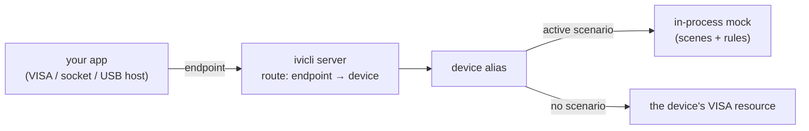

# Mock a VISA instrument

You are building an app that drives a VISA instrument (over HiSLIP, VXI-11,
or a raw SCPI socket) and want to test it without the real hardware on the
bench. This guide stands up a **mock instrument** that answers your app's
SCPI, so your test suite talks to `ivicli` instead of a physical device.

The flow is always three steps:

1. **Author** a *scenario* — the SCPI request/response map for your instrument.
2. **Serve** it over a gateway (HiSLIP `4880`, raw SOCKET `5025`, or a
   USB/IP export the host attaches as a USB instrument).
3. **Point your app** at the gateway's VISA resource string.

If you just want *a* mock to smoke-test against, jump to
[Run a ready-made mock](#run-a-ready-made-mock). To model *your* instrument,
start at [Author a scenario](#author-a-scenario). If the split between
`ivicli mock` and `ivicli server` is unclear, read
[How mock and server fit together](#how-mock-and-server-fit-together) first.

---

## How mock and server fit together

Three nouns carry the whole design, and each has its own command group.

A **device** is an alias for a VISA resource; `ivicli visa add dut
'TCPIP0::127.0.0.1::INSTR'` registers one. Every operation in `ivicli`
targets a device, never a resource string directly.

A **scenario** is behaviour: scenes, rules, and the `*IDN?` string. `ivicli
mock` authors scenarios and *activates* one against a device (`mock scenario
activate my-dmm --for dut`). Activation is a binding, device → scenario, and
it changes how that device is reached: while a device has an active scenario,
`ivicli` answers its SCPI from the in-process mock instead of opening its
resource. The resource string is then a placeholder that is never dialled,
which is why the recipes below register the mock as `TCPIP0::127.0.0.1::INSTR`.
`mock scenario deactivate --for dut` clears the binding, and the same alias
reaches its real resource again.

A **server** is a listener (HiSLIP, raw SOCKET, VXI-11, or USB/IP), and
its **routes** map a public endpoint (a HiSLIP sub-address, a port, a USB
bus id) to a device. `ivicli server` manages servers and routes; a server
does not know whether the device behind a route is a scenario or a bench
instrument. Exposing a real instrument to a remote client and serving a mock
to your test suite are the same three commands with a different device
behind the route.



Reading a mock recipe with this in mind: `visa add` names the device, `mock
scenario activate --for` decides that the device is answered by a scenario,
and `server add` / `server route add` / `server start` decide how clients
reach it.

---

## Run a ready-made mock

The published container serves a built-in scenario (`*IDN?` / `*RST` /
`*OPC?` / `SYST:ERR?`) with no install and no config:

```sh
docker run --rm -p 4880:4880 -p 5025:5025 \
    ghcr.io/shortarrow/ivi-cli-mock:latest
```

Your app connects to `TCPIP::localhost::hislip0::INSTR` (HiSLIP) or
`TCPIP::localhost::5025::SOCKET` (raw socket). That is enough to prove your
transport wiring; to model your instrument's actual behaviour, author a
scenario.

---

## Author a scenario

A scenario has an identity (`*IDN?` string), one or more **scenes** (states),
and **rules** that map an incoming SCPI line to a response. Rules can flip the
active scene, which is how you model stateful instruments (output on/off,
range changes, …).

You can author it two ways — from the CLI, or by hand-writing a TOML file.

### From the CLI

```sh
# 1. Create the scenario with its identity and initial scene.
ivicli mock scenario create my-dmm --idn 'ACME,DMM-1000,SN42,2.1' --initial idle

# 2. Add rules to a scene. Queries respond; writes acknowledge.
ivicli mock scenario rule add my-dmm --in idle --match '*IDN?'     --respond 'ACME,DMM-1000,SN42,2.1'
ivicli mock scenario rule add my-dmm --in idle --match '*RST'      --ack
ivicli mock scenario rule add my-dmm --in idle --match 'MEAS:VOLT?' --respond '3.271'
ivicli mock scenario rule add my-dmm --in idle --match 'SYST:ERR?' --respond '0,"No error"'

```

Activating the scenario, that is, binding it to a device, is part of serving
it, below.

Add a second scene and a transition to model state:

```sh
ivicli mock scenario scene add my-dmm measuring
ivicli mock scenario rule add my-dmm --in idle      --match 'INIT'  --ack --transition-to measuring
ivicli mock scenario rule add my-dmm --in measuring --match 'FETC?' --respond '3.271'
ivicli mock scenario rule add my-dmm --in measuring --match 'ABOR'  --ack --transition-to idle
```

### By hand-writing TOML

The same scenario is a plain TOML file. Drop it in the scenarios directory
(see [Where scenarios live](#where-scenarios-live)) and `ivicli mock scenario
activate my-dmm`, or `ivicli mock scenario import ./my-dmm.toml`.

```toml
idn = "ACME,DMM-1000,SN42,2.1"
initial_scene = "idle"

[[scenes]]
name = "idle"

[[scenes.rules]]
match = "*IDN?"
respond = "ACME,DMM-1000,SN42,2.1"

[[scenes.rules]]
match = "INIT"
ack = true
transition_to = "measuring"

[[scenes]]
name = "measuring"

[[scenes.rules]]
match = "FETC?"
respond = "3.271"
```

### Rule vocabulary

| Field (TOML / CLI flag) | Meaning |
| --- | --- |
| `match` / `--match` | The exact SCPI line this rule answers. |
| `respond` / `--respond` | The response text to return (for a query). |
| `ack` / `--ack` | Accept a write with no response body. |
| `fail` / `--fail` (+ `fail_detail` / `--fail-detail`) | Return a SCPI error instead of a normal response. |
| `transition_to` / `--transition-to` | Switch the active scene after this rule fires. |

> **v0.2.x limitations.** Rules match a full SCPI line literally (no
> parameter capture — `VOLT 7.5` then `VOLT?` still returns the canned
> value), and rule sets are per-scene (static metadata like `*IDN?` is
> repeated in every scene). Both are tracked in issue
> [#26](https://github.com/ShortArrow/ivi-cli/issues/26).

### Quirk profiles

Real instruments misbehave, and code that talks to them has to survive it.
A scenario can ask the mock to reproduce a specific firmware fault through
an optional `[quirks]` table:

```toml
[quirks]
srq_notify_wedge_after = 1
```

`srq_notify_wedge_after` counts service requests delivered to the SRQ
stream. Past that count the mock keeps recording the status byte — a
serial poll still shows the request standing — but no notification is
ever sent again, so a gateway forwarding SRQs to a remote client goes
quiet. This is a Kikusui PWR401L on the bench: after certain session
histories its USB488 notification machinery wedged, and nothing short of
a power cycle brought it back (recorded on PR
[#114](https://github.com/ShortArrow/ivi-cli/pull/114)). Closing and
reopening the device is the mock's power cycle; `0` wedges the stream
before the first notification.

Quirks are hand-written TOML only — there is no CLI flag for them, so
author the file and `ivicli mock scenario import ./wedged.toml`.

---

## Serve it

### Option A — the mock container

Mount your scenarios directory and pick the scenario by name:

```sh
docker run --rm \
  -v "$PWD:/etc/ivi-cli/scenarios" \
  -e IVICLI_SCENARIO=my-dmm \
  -p 4880:4880 -p 5025:5025 \
  ghcr.io/shortarrow/ivi-cli-mock:latest
```

### Option B — the bare CLI

Register a device, bind the scenario to it, and expose it through a gateway
server:

```sh
ivicli visa add dut 'TCPIP0::127.0.0.1::INSTR'      # placeholder resource; never dialled while a scenario is active
ivicli mock scenario activate my-dmm --for dut       # dut now answers from the scenario
ivicli server add dmm-srv --type hislip --port 4880 # or --type socket --port 5025
ivicli server route add dmm-srv hislip0 dut         # SOCKET: route the port itself
ivicli server start dmm-srv
```

`activate` needs a device: pass `--for`, or select one once with `ivicli visa
use dut` and omit it afterwards.

Either way the mock now listens on:

| Transport | VISA resource |
| --- | --- |
| HiSLIP | `TCPIP::localhost::hislip0::INSTR` |
| Raw SOCKET | `TCPIP::localhost::5025::SOCKET` |

### Option C — as a USB device

A `usbip` server exports the device over the USB/IP protocol, and a USB/IP
client on the host attaches it as if it were plugged in: the operating
system enumerates it, the class driver binds, and NI-VISA lists it like any
USB instrument. On the ivicli side only the server type and the
shape of the endpoint change: the endpoint is a USB bus id such as `1-1`.

```sh
ivicli visa add dut 'TCPIP0::127.0.0.1::INSTR'
ivicli mock scenario activate my-dmm --for dut
ivicli server add usb-srv --type usbip               # listens on 3240
ivicli server route add usb-srv 1-1 dut              # USBTMC (default profile)
ivicli server route add usb-srv 1-2 dut --profile cdc-acm   # the same device as a serial port
ivicli server start usb-srv
```

The client is USB/IP tooling on the host; ivicli installs no driver.

| Host | Client | Attach |
| --- | --- | --- |
| Windows 11 | [usbip-win2](https://github.com/vadimgrn/usbip-win2), a release whose drivers are WHLK-certified | `usbip.exe attach -r 127.0.0.1 -b 1-1` |
| Linux | in-kernel `vhci-hcd` + `usbip` from `linux-tools` | `sudo usbip attach -r <host> -b 1-1` |

`usbip list -r <host>` shows the exports before you attach; `usbip detach -p
<port>` unplugs. A non-default server port goes to the client as `-t <port>`
(usbip-win2 takes it before the subcommand).

What the host then sees depends on the route's profile:

| Profile | Enumerates as | Reach it with |
| --- | --- | --- |
| `usbtmc` (default) | USB Test & Measurement device, VID `0x1209` PID `0x0001`, serial = the device alias | `USB0::0x1209::0x0001::dut::INSTR` in NI-VISA and `ivicli visa scan` |
| `cdc-acm` | USB serial device, VID `0x1209` PID `0x0002` | a COM port on Windows, `/dev/ttyACM*` on Linux; 115200 8-N-1, one SCPI line per newline |

Use the USBTMC profile when the code under test goes through a vendor VISA
stack and you want that stack in the loop: its resource enumeration, its USB
class driver, its I/O trace tools. Use the CDC-ACM profile for tools
that only speak COM ports.

A device is attached through one route at a time; the client refuses a
second attach while the first is up. Detach, then attach the other profile.

### Swap behaviour on a running mock

You can `activate` a different scenario against a gateway that is already
serving — no restart, no reconnect. The change is picked up on the client's
next query:

```sh
ivicli mock scenario activate my-dmm-faulted --for dut   # while the app stays connected
```

The next SCPI operation on the open connection sees the new scenario. An
unchanged binding keeps its in-flight scene, so re-running `activate` with the
same scenario does not reset a state machine the client already advanced. This
works identically over HiSLIP, raw SOCKET, VXI-11, and a USB/IP export.

---

## Point your app at it

- **`ivicli` or any SCPI client** — use the resource string above:

  ```sh
  ivicli visa add tester 'TCPIP::localhost::hislip0::INSTR'
  ivicli visa query tester '*IDN?'   # → ACME,DMM-1000,SN42,2.1
  ```

- **Apps that go through NI-VISA / Keysight VISA** (they resolve resources
  through the vendor runtime, not ivicli) — register the mock as a static
  TCP/IP resource in **NI MAX** (or Keysight Connection Expert): add a
  *Network Instrument* / *Manual TCP/IP* entry pointing at `localhost` with
  the HiSLIP sub-address `hislip0` or the raw-socket port `5025`. The
  [PSU sample](../samples/psu/) `setup.ps1` prints the exact NI MAX steps at
  the end of its run.

---

## Verify what your app sent

When your app drives the mock through its own VISA stack, the test never sends
raw SCPI itself — so how do you assert the app wrote `:VOLT 24.000` and not, say,
`:VOLT 24` or nothing at all? Start the gateway with traffic capture on, then
read back the writes out of band:

```sh
# Start the mock with capture enabled. Use a FRESH path per test run so a
# previous run's writes don't leak in (see isolation note below).
IVICLI_CAPTURE=run-$RANDOM.ndjson ivicli server start dmm-srv

# ... your app connects and writes :VOLT 24.000 ...

# Last :VOLT write the device received (substring filter):
ivicli mock received dut --match ':VOLT' --capture run-*.ndjson
# → :VOLT 24.000        (exit 0; exit 1 if nothing matched)

# Assert the exact command arrived — ':VOLT' as a substring would also match
# ':VOLT:PROT 30', so use --exact when you mean the whole line:
ivicli mock received dut --exact ':VOLT 24.000' --capture run-*.ndjson

# How many times did the app set the voltage? (--count exits 0 even at 0)
ivicli mock received dut --match ':VOLT' --capture run-*.ndjson --count
# → 1

# Machine-readable — always a JSON array (single element by default, [] if none):
ivicli mock received dut --match ':CURR' --capture run-*.ndjson --json
# → [{"device":"dut","scpi":":CURR 3.300","timestamp":"..."}]
```

`--match` filters by substring and `--exact` by full string (mutually
exclusive); the default reports the most recent matching write (add `--all` to
list every match, oldest first, or `--count` for just the number). Absent
`--count`, a non-zero exit when nothing matched lets a test assert a write did
*not* arrive. The capture is the shared audit log; the reader opens it with
shared access, so you can query it while the gateway is still serving.

**Isolation.** The capture *appends* across runs, so `--all` and the default
"last" can surface writes from an earlier run. Give each test run its own
`IVICLI_CAPTURE` file (or truncate it before the run) — there is deliberately no
time filter.

---

## Record instead of author

If you have the real instrument available once, capture a session and replay
it — no rules to write by hand:

- **Capture → import.** Run any workflow with `IVICLI_CAPTURE=<file>` against
  the real device, then `ivicli mock scenario import <file>` turns the
  captured traffic into a scenario.
- **Record a script.** `ivicli mock scenario record <name> --from-script
  <script>` captures the SCPI of a script run directly into a scenario.

Replay it deterministically anywhere with `IVICLI_REPLAY=<name>`.

---

## Where scenarios live

The CLI looks for scenarios under the platform config directory (a sibling of
`config.toml`):

| OS | Default path |
| --- | --- |
| Linux | `$XDG_CONFIG_HOME/ivi-cli/scenarios/` (default `~/.config/ivi-cli/scenarios/`) |
| macOS | `~/.config/ivi-cli/scenarios/` |
| Windows | `%LOCALAPPDATA%\ivi-cli\scenarios\` |
| Container | `/etc/ivi-cli/scenarios/` |

Override the root with `IVICLI_CONFIG=<path>`.

---

## Next steps

- **[PSU sample](../samples/psu/)** — a complete, runnable two-state FSM
  (output on/off) with `setup.sh` / `setup.ps1` and the NI MAX steps.
